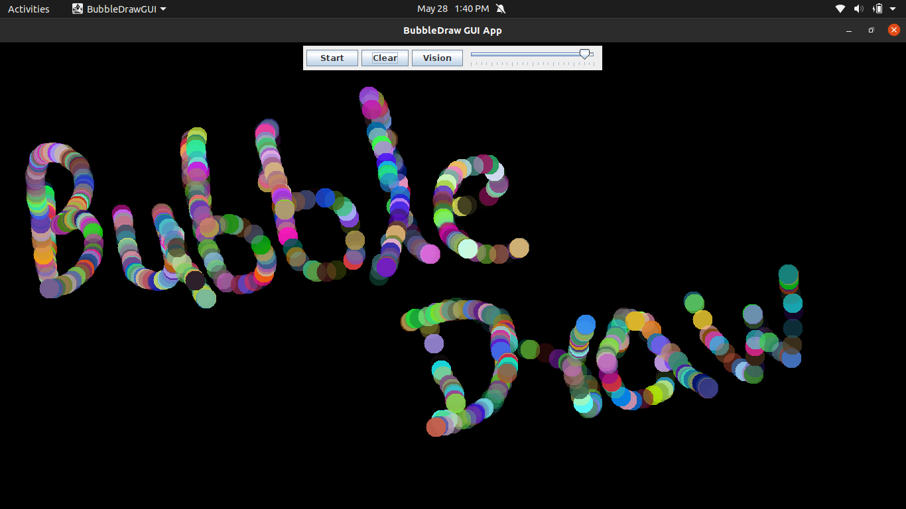
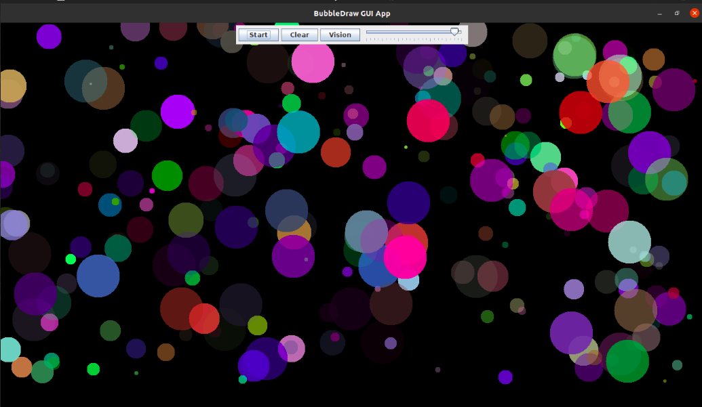
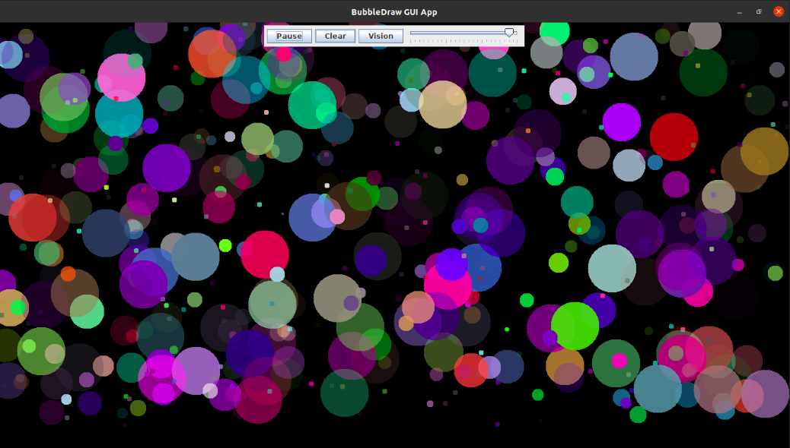

# BubbleDraw
An interactive, animated drawing app that lets the user draw floating, bouncy, colorful bubbles.

## Table of contents
* [General info](#general-info)
* [Technologies](#technologies)
* [Illustrations](#illustrations)
* [Features](#features)

## General info
The BubbleDraw app lets the user draw randomly colored bubbles using the mouse.

## Technologies
Project is created with:
* java version "15.0.1" 2020-10-20
* Java(TM) SE Runtime Environment (build 15.0.1+9-18)
* Java HotSpot(TM) 64-Bit Server VM (build 15.0.1+9-18, mixed mode, sharing)

## Illustrations

## Features
* It will let the user draw bubbles of random colors whenever they click and drag the mouse on the app window.
* User will also be able to change the size of the bubbles by scrolling the mouse wheel up and down or by using a scroll gesture.
* Each bubble in a different random color and speed.

